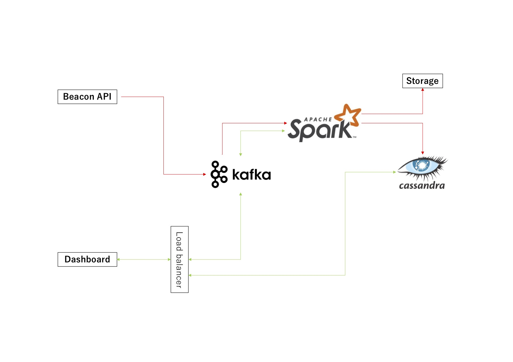

# アーキテクチャデザイン

## 解説

### イベントデータの受付と書き込み

1. ユーザーの行動ログ、イベントは、Javascriptによって、Apache Kafkaで直接リクエストを受ける。
2. Apache Kafkaで受けたイベントデータは、Apache Spark Streamによって、データを流す。
3. データの形式によって、データストレージへ保存したり、Apache Kassandraなどのデータベースへの保存を行う。

### ダッシュボードからのイベントデータの利用

1. webダッシュボードから、ある程度の過去のデータに関しては、Apache Sparkによって処理されたApache Cassandraへデータを読みにいく。
2. リアルタイム性が必要なデータに関しては、Apache Kafkaのイベントを通り、Apache Sparkによって集計されたデータを、管理画面へ戻すことも可能。

### 負荷対策について

1. Apache Kafka, Spark, Cassandraとも、クラスターを増やすことで、それぞれのポイントで負荷分散が可能であるため、このシステム設計とした。
